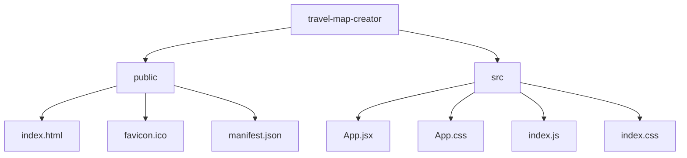

# Travel Map Creator

A React application that allows users to create customizable travel maps. This project was inspired by the CreateTravelMap.com website, but built as a local application that doesn't require server-side processing.

## Features

- **Add Locations**: Search for and add locations to your map
- **Rearrange Points**: Drag and drop to reorder your locations
- **Customize Map Style**: Choose from different map styles
- **Name Your Journey**: Add a title and description to your map
- **Layout Options**: Toggle between portrait and landscape orientation
- **Download Map**: Save your map as a PNG image

## Installation

1. Clone this repository
2. Install dependencies:
   ```
   npm install
   ```
3. Start the development server:
   ```
   npm start
   ```

## How to Use

1. **Add Locations**:

   - Use the search bar to find locations
   - Click on a result to add it to your map
   - Drag and drop locations to reorder them

2. **Customize Map**:

   - Select from different map styles
   - Add a title and description
   - Choose between portrait or landscape orientation

3. **Download Your Map**:
   - Click the "Download Map" button to save your map as a PNG image

## Technical Implementation

This application uses:

- React for the user interface
- Leaflet for the interactive maps
- Nominatim (OpenStreetMap) for geocoding
- react-beautiful-dnd for drag and drop functionality
- html2canvas for map image export

## Project Structure



## Dependencies

- React
- Leaflet & React-Leaflet
- axios
- html2canvas
- react-beautiful-dnd

## License

MIT

## Credits

This project was inspired by CreateTravelMap.com but is an independent implementation.
